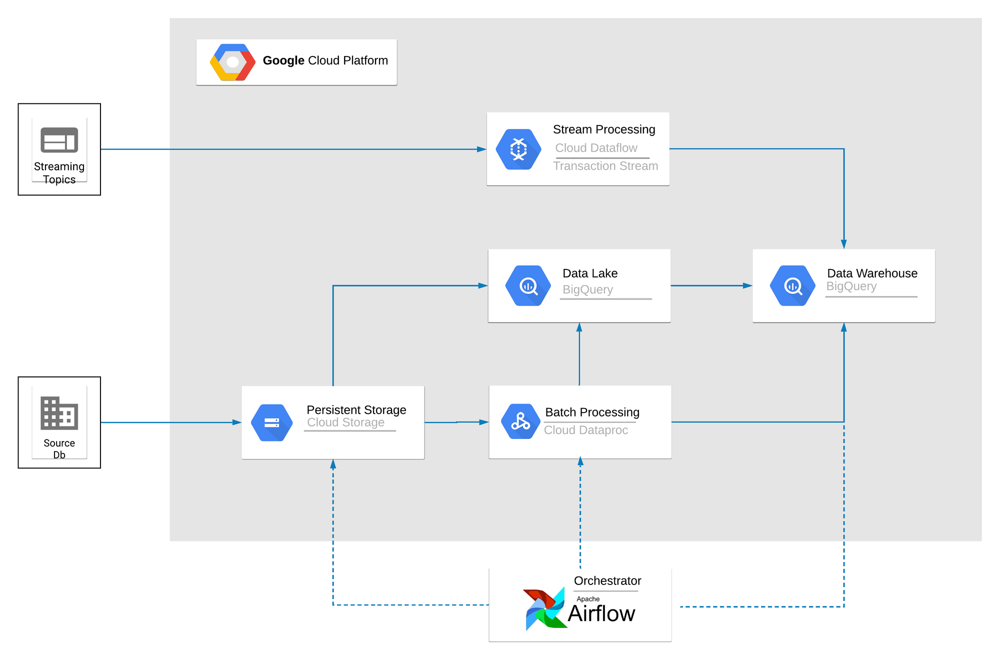
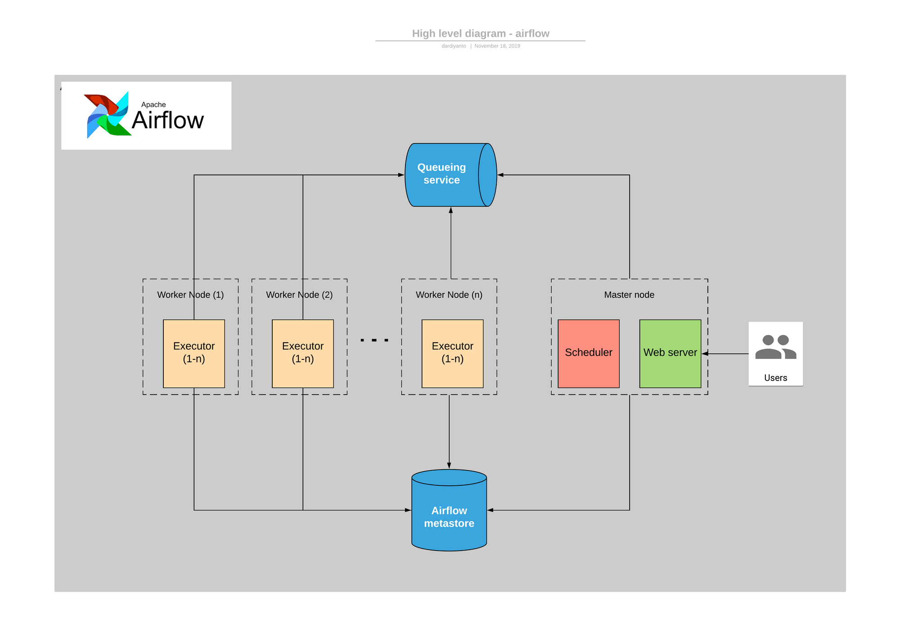

= Architecture Imperium

== Architecture Diagram Imperium

. Task pertama yang dikerjakan oleh Imperium adalah '_extract_' data dari source db Alterra berdasarkan _schedule_ yang sudah di-_set up_ di airflow sebagai _orchestrator_-nya dan menyimpan data hasil proses '_extract_' di Google Cloud Storage (GCS)
. Selanjutnya data tersebut akan di '_load_' ke _datalake_, dalam _high level_ ini kita menggunakan BigQuery sebagai _datalake_-nya dan _scheduler_ serta task-nya akan di-_define_ dalam airflow.
. Proses selanjutnya adalah '_transform_' data yang sudah di-_load *sehingga sesuai dengan bentuk data yang diinginkan dan mudah untuk dikonsumsi, dalam *planning_-nya, task ini akan dikerjakan oleh '_BigQuery_' atau '_Google dataproc_'.
Bila sudah ada kebutuhan untuk _streaming processing_ secara _planning_ kita akan menggunakan '_dataflow_' untuk _stream transaction_ ke datalake atau datawarehouse.
. Hasil dari process ETL tersebut adalah _raw data_ yang siap dikonsumsi oleh segala _service_ yang ada di Alterra.
Dalam datalake atau datawarehouse akan dibuat berbagai _layer_ yang sesuai dengan kebutuhan _service_.

== High level diagram - Airflow

. Apache Airflow memiliki beberapa komponen diantaranya: Worker, Scheduler, Web UI (Dashboard), Web Server, Database, dst dalam menjalankan tugasnya dan untuk menggerakkan workflow yang kita buat.
. Komponen utama dalam membangun workflow atau data-pipeline menggunakan Apache Airflow adalah DAG, karena setiap kali kita membuat sebuah workflow pastinya kita akan menuliskan barisan kode berupa DAG atau sekumpulan dari tasks.
DAG inilah yang mencerminkan tentang alur dari workflow beserta relasi antar proses dan ketergantungan antar prosesnya.
. Setelah membuat beberapa task yang akan dijalankan maka akan dimuat oleh Scheduler yang sudah di-_set_ sebelumnya berdasarkan kebutuhan.
Scheduler adalah "`petugas`" yang bertanggung jawab dalam memantau semua DAG beserta tasks yang ada, dan memicu (men-_trigger_) semua Task Instances yang dependensinya telah terpenuhi, scheduler ini juga yang memastikan DAGs yang ada di dalam DagBag tetap tersinkronisasi dengan Airflow dan atau menginisialisasi DagRun pada metadata database
. Scheduler :
 ** memeriksa kondisi (status) dari `TaskInstances` yang terhubung dengan `DagRun` yang sedang aktif
 ** menyelesaikan semua ketergantungan tiap `TaskInstance`
 ** mengidentifikasi `TaskInstance` yang harus dieksekusi
 ** menambahkannya kedalam Worker queue
 ** memperbarui status dari `TaskInstance` dari "`newly-queued`" ke "`queued`" pada database
. Tiap worker yang tersedia, mengambil `TaskInstance` dari queue dan menjalankannya kemudian memperbarui status `TaskInstance` dari "`queued`" ke "`running`"
. Ketika `TaskInstance` berhasil dijalankan, maka Worker yang terkait mengubah statusnya pada database menjadi: "`finished`", "`failed`", dst (tergantung dari kondisi `TaskInstance` saat dijalankan)
. Scheduler mengubah status semua `DagRun` yang aktif ke: "`running`", "`failed`", "`finished`".
Tergantung pada semua kondisi `TaskInstance`
. Ulangi langkah 2 s/d 6

Sumber : https://imamdigmi.github.io/post/tutorial-airflow-part-1/
