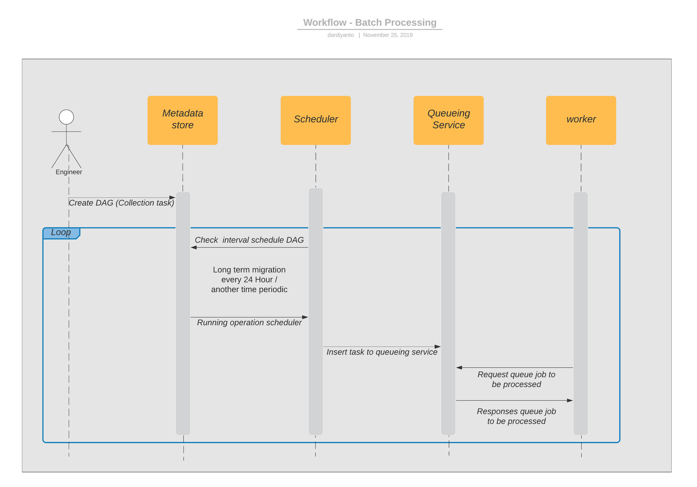

= Flow and Wireframe Imperium

== Batch Processing Flow

Deskripsi :

. Step awal dalam melakukan _batch processing_ adalah dengan membuat pipa pemrosesan data  yang dalam _airflow_ disebut dengan _DAG_ merupakan kepanjangan dari Directed Acyclic Graphs yang kita gunakan untuk membuat suatu workflow atau kita juga dapat memahami DAG sebagai sekumpulan dari Tasks yang akan di eksekusi.
. DAG yang dibuat akan disimpan di _metadata store_
. Scheduler akan melakukan checking secara berkala pada _metadata store_ untuk memutuskan tugas mana yang perlu dieksekusi, serta prioritas pelaksanaannya.
Dalam hal ini '_batch processing_' menggunakan interval waktu per 24 jam sekali akan menjalankan _task_ untuk _extract_ dan _load_ data dari source ke datalake.
. Bila ada _task_ yang harus di eksekusi, scheduler akan menjalankan service nya untuk memasukkan _task_ tersebut ke dalam _queueing service, queueing service_ dapat mendistribusikan _task_ pada banyak _worker_ untuk di ekseskusi.
. Selanjutnya _worker_ akan menjalankan logic dari task yang di eksekusi.
